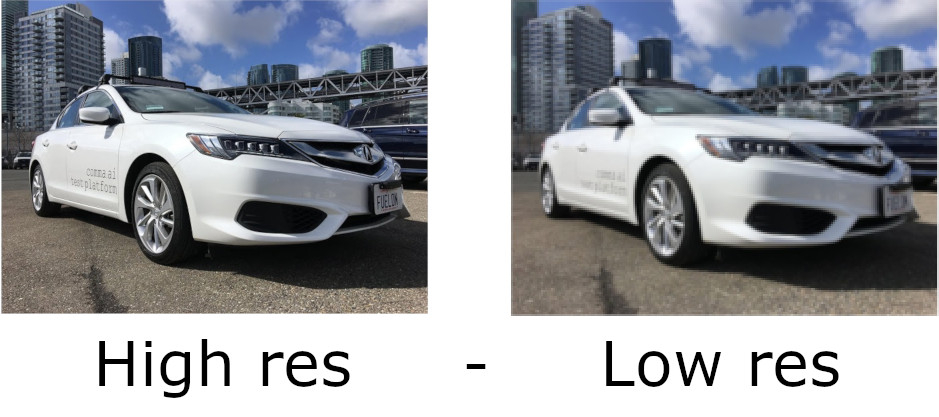

# Image Super Resolution Using Auto Encoders in Keras

Here in this project we are using Autoencoders for image super resolution. Super resolution is a technique used to improving the resolution of input image. That is converting a low resolution image to high resolution.

## What is Autoencoders ?

Autoencoders are the identity function of AI. Its a kind of nueral network that try to learn the input data. It having two blocks. One is Encoder block and other is Decoder block.

***Encoder*** is used to compress(reduce the dimensionality) input into smaller feature space(dimensionality). PCA or Kernel-PCA used for the same purpose. But autoencoders are more efficient. They are good at compression in general.

***Decoder*** re-construct the image from the copressed feature space. Autoenocder operation is lossy process. and we take advantage of this lossy process.

In our case both encoder are decoder are CNN networks.

***Loss function*** is used to find the meaningful difference between the input image and recontructed output.

Autoencoder can have different functionality such as Super resolution, Image denoising, Image generation, Detection in medical domain[u-net]. Autoencoders try to compare the input image with output image and learns faster.

## Super Resolution Using Autoencoders

 Here we are training the Autoencoder for image super resolution. We will use low resolution image at input and high resolution images as ground-truth. First we de-construct and then re-construct the input image.

### Dataset

We are going to train out custom model for car image super resolution. Note that, the network is trained specifically for Car images.

The dataset of Cars that I used here is a subset of Imagenet dataset. And using this Car image dataset manually  I created the low resolution copies as input to the network. And kept the original high-resolution images as ground-truth.

### Enoder Architecture

### Decoder Architecture

### Complete Architecture Of Autoencoder Network

### Sample Output

1. Low-resolution input image. (128\*128\*3)
2. Enlarge image using bicubic interpolation. (256\*256\*3)
3. Encoded output with smaller dimentionality. (64\*64\*256)
4. Autoencoder output image. (256\*256\*3)
5. Ground-truth image. (256\*256\*3)